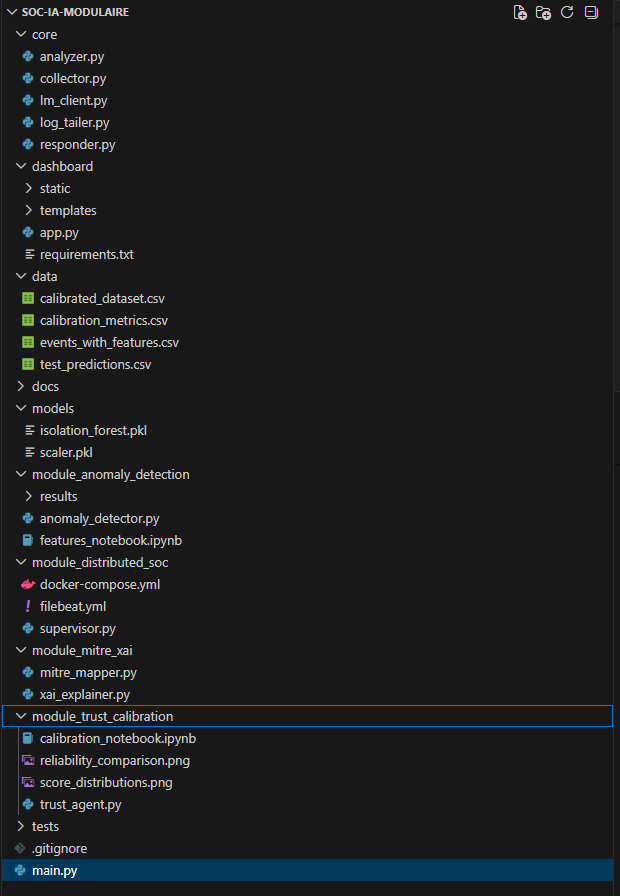
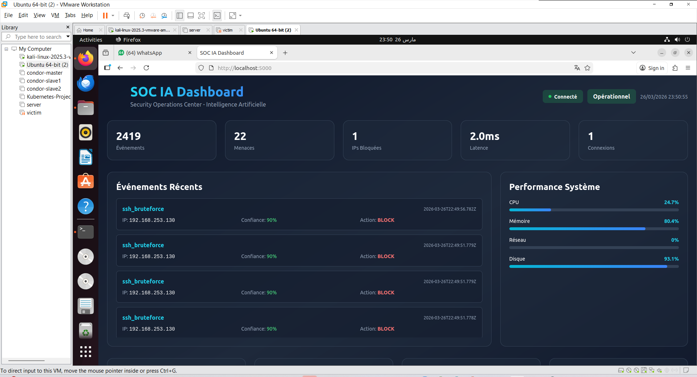

# SOC AI Modular Threat Detection Platform

An intelligent and modular Security Operations Center (SOC) powered by Artificial Intelligence for real-time threat detection, analysis, and response.

---

## Overview

This project implements a **modular AI-based SOC architecture** integrating:

*  Log collection & analysis
*  Machine Learning anomaly detection (Isolation Forest)
*  Confidence calibration (Platt Scaling)
*  MITRE ATT&CK mapping
*  Explainable AI (XAI)
*  Automated response system
*  Real-time monitoring dashboard

---

##  Architecture

```
Log Tailer → Collector → Anomaly Detector → Analyzer → 
Trust Calibration → MITRE Mapper → XAI → Responder → Dashboard
```


---

##  Project Structure

```
core/                         # Core SOC components
module_anomaly_detection/     # ML anomaly detection
module_trust_calibration/     # Confidence calibration
module_distributed_soc/       # Distributed system (Kafka)
module_mitre_xai/             # MITRE mapping + explainability
dashboard/                    # Web dashboard (Flask)
data/                         # Datasets
models/                       # Trained ML models
tests/                        # Attack simulation
```


---

## ⚙️ Features

### 🔹 Core SOC

* Log ingestion & parsing
* Threat analysis (heuristics + AI)
* Automated response (blocking & alerts)

### 🔹 Machine Learning

* Isolation Forest anomaly detection
* Feature engineering & evaluation

### 🔹 Trust Calibration

* Platt scaling for confidence adjustment

### 🔹 MITRE ATT&CK Integration

* Mapping threats to known techniques

### 🔹 Explainable AI

* Transparent decision explanations

### 🔹 Dashboard

* Real-time visualization
* Threat monitoring

---

## ▶️ How to Run

### 1. Clone repository

```
git clone https://github.com/ChaimaeAb1/soc-ai-modular-threat-detection.git
cd soc-ai-modular-threat-detection
```

---

### 2. Install dependencies

```
pip install -r dashboard/requirements.txt
```

---

### 3. Run SOC backend

```
python main.py
```

---

### 4. Run dashboard

```
cd dashboard
suso python3 app.py
```

---

### 5. Open browser

```
http://localhost:5000
```

---

##  Optional: Distributed Mode (Kafka)

```
cd module_distributed_soc
docker-compose up -d
```

---

##  Results



---

##  Testing

```
cd tests
python loadgen.py
```

---

##  Academic Context

This project was developed as part of a Master's program in **IT Security and Big Data**, focusing on:

* Cybersecurity
* Artificial Intelligence
* Distributed Systems

---

## 👩‍💻 Author

**Chaimae Ababri**
Master's Student in IT Security & Big Data

---

##  Future Improvements

* Deep learning models (LSTM, Transformer)
* SIEM integration
* Cloud deployment (AWS / Kubernetes)
* Real-time streaming optimization

---
